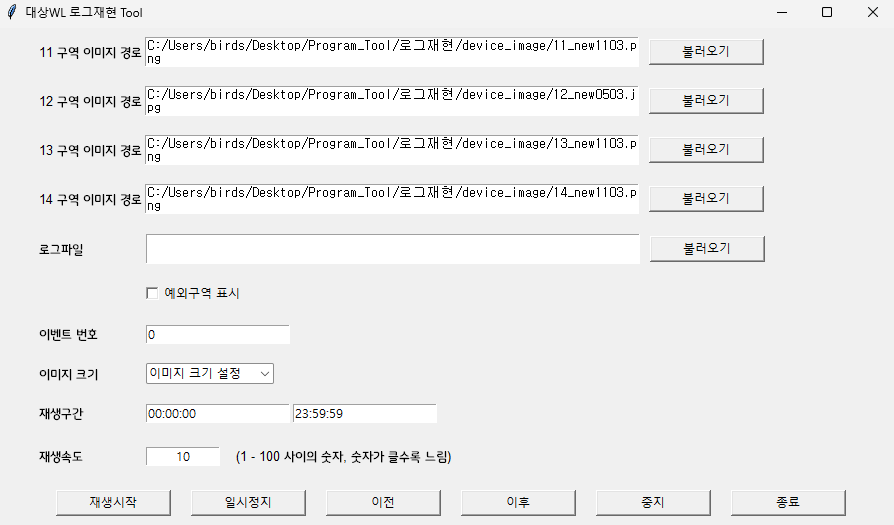
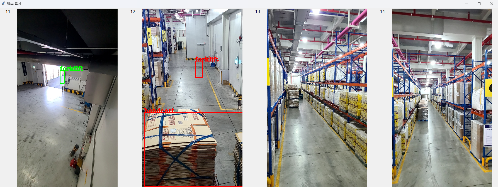

# 대상WL 로그재현 Tool

## Installation 설치방법
Windows CMD 창에서 실행

```shell
cd "설치하고자 하는 경로"
git clone http://corners.iptime.org:30000/corners_dev_grp1/machine-learning/test-applications/python-applications/pythontools.git
cd pythontools/대상WL\ 로그재현\ Tool/
pip install -r requirements.txt
python main.py
```

## 사용방법


---
 이미지 띄웠을 때 화면 캡쳐

---

### 이미지 불러오기
1. 11, 12, 13, 14 구역 이미지 경로의 각각의 불러오기 버튼을 이용하여 이미지를 불러옵니다.
2. 한번 불러온 이미지는 폴더 안의 path.txt에 저장되며 프로그램 종료 후 다시 시작할 때 저장된 경로가 불러와 집니다.
> * device_image 폴더 안에 "NIPA_번호"로 시작되는 이미지를 넣어두었습니다.

---

### 로그파일 불러오기
1. 로그파일의 불러오기 버튼을 이용하여 불러오고자 하는 로그 파일을 불러옵니다.
> * ".log", ".txt" 파일 형식 둘다 지원
2. 로그 재생이 끝나면 로그가 끝났다는 메시지가 뜹니다.
> * 확인 버튼을 누른 후 이전을 누르시면 전 분석으로 돌아갈 수 있습니다.
> * 확인 버튼을 누른 후 재생시작을 누르시면 처음부터 시작합니다.

---

### 시작시간 & 종료시간 설정
1. 시작시간과 종료시간을 설정할 수 있습니다. 시간은 00:00:00 형식으로 입력해야합니다.
> * 시작시간과 종료시간을 설정 안할 경우 로그 파일의 처음부터 재생합니다.

---

### 예외구역 표시기능
1. 재생시작 전에 예외구역 표시 체크를 하면 재생하였을 때 예외구역 표시가 되지 않습니다.

---

### 하단 버튼(재생시작, 일시정지, 이전, 이후, 중단, 종료)
- 재생시작: 로그파일을 재생합니다
- 일시정지: 재생을 정지합니다
- 이전: 일시정지된 분석 상태에서 바로 전 분석을 불러옵니다
- 이후: 일시정지된 분석 상태에서 바로 다음 분석을 불러옵니다
- 중단: 로그재생 종료(이미지 화면 닫힘)
- 종료: 프로그램 전체 종료
